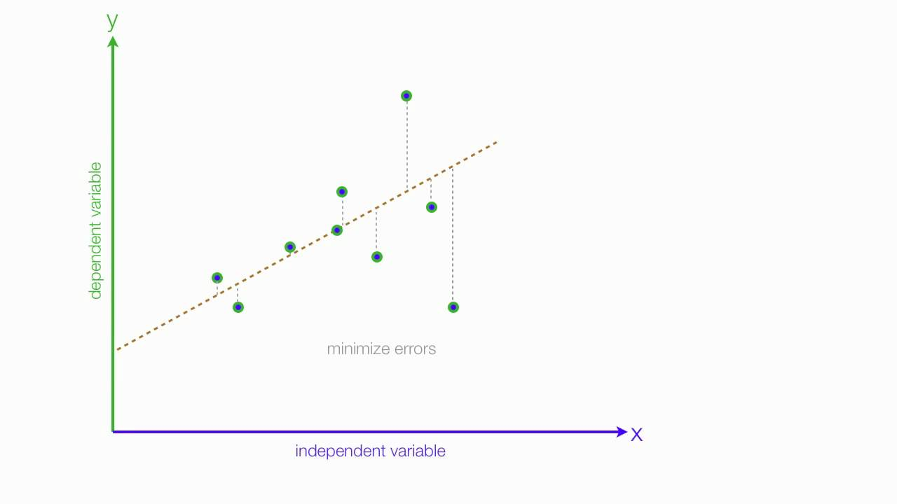

# 선형 회귀 모형

## 선형 회귀 모델이란?
선형 회귀는 종속변수 y와 한 개 이상의 독립 변수(설명 변수) x와의 선형 상관 관계를 모델링하는 회귀분석 기법이다. 한개의 설명변수의 경우 단순 선형 회귀, 둘 이상의 설명 변수에 기반한 경우에는 다중 선형 회귀라고 한다. 

선형 회귀는 여러 사용 사례가 있지만, 대개 아래와 같은 두가지 분류로 사용된다.
* 값을 예측하는 목적일 경우 선형 회귀를 사용해 데이터에 적합한 예측 모형을 개발한다. 개발한 선형 회귀식을 사용해 y가 없는 x값에 대해 y를 예측한다.
* 종속 변수 y와 이것과 연관된 독립변수 X1,...,Xp가 존재하는 경우, 선형 회귀 분석을 사용해 Xj와 y의 관계를 정량화할 수 있다.

## 선형 회귀 모델의 추정
### 수식
선형 회귀 모델은 y = b1x1+b2x2+...+b0 + error의 형태를 가지고 있다. 
b는 각 독립변수의 계수 및 상수항을 의미하고, error는 오차 변수로 관찰되지 않은 확률 변수이며, 종속 변수와 독립 변수 사이에 오차를 의미한다.
이를 벡터 형태 형식으로 나타내면 다음과 같이 표현 가능 하다. 

### 회귀모형의 가정 
선형 회귀 분석 문델은 예측변수, 응답변수 그리고 그 사이의 관계에 대해 다양한 가정을 한다. 
* 약한 외생성
* 선형성
* 상수 분산
* 오차의 독립성
* 예측 변수에서의 다중공선성 부재
### 회귀모형 추정 기법 
#### 최소제곱법(method of least squares)
최소제곱법은 어떤 계의 해방정식을 근사적으로 구하는 방법으로, 근사적으로 구하려는 해와 실제 해의 오차의 제곱의 합이 최소가 되는 해를 구하는 방법이다.

* OLS

OLS 추정은 일반적으로 실험이나 관측치에 적용하고자 할 때 사용한다. OLS 기법은 오차의 제곱의 합을 최소화하는 기법으로 추정하고자 하는 파라미터에 b에 대한 표현식을 다음과 같이 구할 수 있다. 

#### 경사하강법
회귀모형의 경우 위의 추정식을 통해 바로 구할 수 있지만 경사하강법을 통해 계수를 추정 가능하다.
경사하강법은 1차 근사값 발견용 최적화 알고리즘으로 기본 아이디어는 함수의 기울기를 구하여 기울기가 낮은 쪽으로 계속 이동시켜서 극값에 이를 때까지 반복시키는 것이다. 

최적화할 함수 f(x)에 대하여, 먼저 시작점 x0를 정하고 현재 xi가 정해졌을 때, 그 다음으로 이동할 점인 xi+1은 다음과 같이 계산된다.

이때 ri는 이동할 거리르 조절하는 매개 변수이며, 이 알고리즘의 수렴 여부는 f의 성질과 ri의 선택에 따라 달라진다.
이 알고리즘은 지역 최적해로 수렴하기 때문에 구한 값이 전역 최적해인 보장은 없다.

선형회귀분석에 대해 적용하기 위해 목적식으로 실제 해와 회귀 모형으로 추정한 값의 차이의 제곱으로 설정한다. 

[참고(선형 회귀) : wiki](https://ko.wikipedia.org/wiki/%EC%84%A0%ED%98%95_%ED%9A%8C%EA%B7%80)
[참고(경사 하강) : wiki](https://ko.wikipedia.org/wiki/%EA%B2%BD%EC%82%AC_%ED%95%98%EA%B0%95%EB%B2%95)
